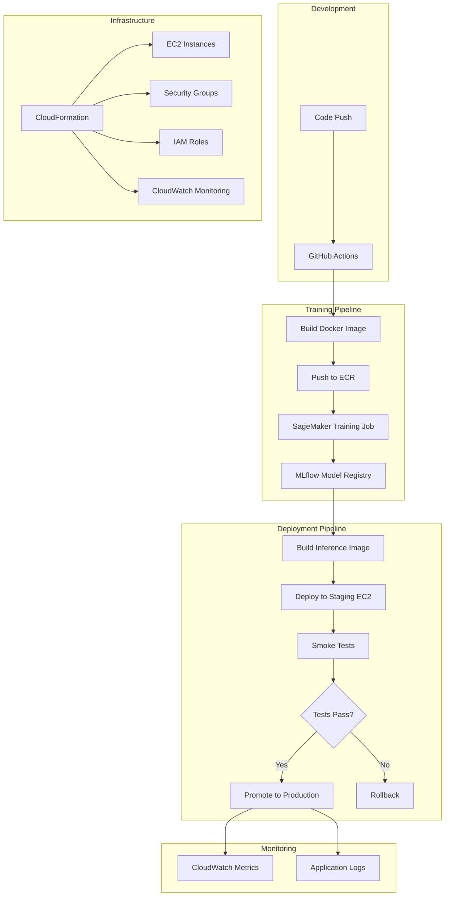

# BERT Genre Classification MLOps Pipeline

A production-ready MLOps pipeline for training and deploying BERT-based text classification models using AWS SageMaker, MLflow, and automated CI/CD workflows.

## 🎯 Project Overview

This pipeline implements an end-to-end machine learning operations (MLOps) solution for text genre classification using BERT models. It features:

- **Automated Training**: SageMaker-based distributed training with hyperparameter optimization
- **Model Versioning**: MLflow integration for experiment tracking and model registry
- **CI/CD Pipeline**: GitHub Actions workflows for automated building, training, and deployment
- **Infrastructure as Code**: CloudFormation templates for reproducible infrastructure
- **Production Deployment**: EC2-based inference API with health monitoring
- **Quality Assurance**: Automated smoke testing and model validation

## 🏗️ Architecture



## 🚀 Quick Start

### Prerequisites

- AWS Account with appropriate permissions
- GitHub repository with Actions enabled
- Docker installed locally (for development)
- Python 3.9+

### Initial Setup

1. **Clone the repository**
   ```bash
   git clone <repository-url>
   cd <repository-name>
   ```

2. **Configure GitHub Secrets**
   ```
   AWS_ACCESS_KEY_ID          # AWS access key
   AWS_SECRET_ACCESS_KEY      # AWS secret key
   AWS_REGION                 # AWS region (e.g., us-east-1)
   SAGEMAKER_EXECUTION_ROLE   # ARN of SageMaker execution role
   MLFLOW_TRACKING_SERVER_ARN # MLflow tracking server ARN
   S3_BUCKET_NAME            # S3 bucket for artifacts
   VPC_ID                    # VPC ID for EC2 deployment
   SUBNET_ID                 # Subnet ID for EC2 deployment
   EC2_SSH_KEY               # SSH private key for EC2 access
   GH_TOKEN                  # GitHub token for tagging
   ```

3. **Deploy Infrastructure**
   ```bash
   # Deploy EC2 infrastructure
   # Trigger the "Deploy EC2 Instance" workflow in GitHub Actions
   # Select environment: staging or prod
   ```

4. **Train Model**
   ```bash
   # Trigger the "SageMaker Training Pipeline" workflow
   # Or push changes to train/ directory
   ```

5. **Deploy Model**
   ```bash
   # Trigger the "Deploy inference" workflow
   # Model will be deployed after successful smoke tests
   ```

## 📦 Pipeline Components

### 1. Training Pipeline (`train/`)

**Purpose**: Trains BERT models for text classification using SageMaker.

**Key Files**:
- `train/train.py`: Main training script with MLflow integration
- `train/Dockerfile.train`: Training container definition
- `train/requirements.txt`: Python dependencies

**Workflow**: `.github/workflows/build-training-image.yml`
- Triggers on push to `train/` directory
- Builds and pushes Docker image to ECR
- Tags with semantic versioning

### 2. Inference Pipeline (`infer/`)

**Purpose**: Serves trained models via REST API using LitServe.

**Key Files**:
- `infer/app/genre_classifier.py`: API implementation
- `infer/Dockerfile.infer`: Inference container definition
- `infer/tests/unit_tests.py`: Comprehensive unit tests
- `infer/tests/smoke_test.py`: End-to-end validation

**Workflow**: `.github/workflows/build-inference-image.yml`
- Builds optimized inference container
- Downloads model artifacts from MLflow
- Runs unit tests before building

### 3. Infrastructure (`cloudformation/`)

**Purpose**: Defines AWS infrastructure as code.

**Key Files**:
- `cloudformation/ec2-instance.yaml`: EC2 instance configuration
  - Includes CloudWatch agent for monitoring
  - Configures security groups and IAM roles
  - Supports both staging and production environments

**Features**:
- Auto-scaling ready
- CloudWatch monitoring enabled
- SSM access for secure management
- Docker pre-installed

### 4. Deployment Workflows

**Training Workflow** (`.github/workflows/sagemaker-training.yml`):
```yaml
Inputs:
- instance_type: SageMaker instance type
- epochs: Number of training epochs
- use_spot: Use spot instances for cost savings
```

### Deployment Workflow (`.github/workflows/deploy-inference.yml`):
1. Deploy to staging
2. Run smoke tests with proper environment variables
3. If successful, promote to production
4. Alias model as "champion" in MLflow

**Important**: The deployment workflow must set environment variables correctly for the smoke test:
```yaml
- name: Perform smoke testing
  env:
    HOST: ${{ env.PUBLIC_IP_STAGING }}  # Must match smoke test expectation
    MLFLOW_TRACKING_SERVER_ARN: ${{ secrets.MLFLOW_TRACKING_SERVER_ARN }}
    EC2_INSTANCE_ID: ${{ env.INSTANCE_ID_STAGING }}
    MODEL_NAME: "bert-genre-classifier"
    PUBLIC_IP_STAGING: ${{ env.PUBLIC_IP_STAGING }}  # Required by smoke test
    USERNAME: ubuntu
  run: |
    python infer/tests/smoke_test.py
```

## ⚙️ Configuration

### Environment Variables

**Training Container**:
```bash
MLFLOW_TRACKING_URI       # MLflow server endpoint
SM_TRAINING_JOB_NAME     # SageMaker job name (auto-set)
SM_MODEL_DIR             # Model output directory
SM_CHANNEL_TRAINING      # Training data location
```

**Inference Container**:
```bash
TOKENIZER_PATH           # Path to BERT tokenizer
MODEL_PATH              # Path to trained model
LABELS_PATH             # Path to label mappings
```

### Model Configuration

**Supported Models**:
- bert-base-uncased (default)
- Any HuggingFace BERT variant

**Hyperparameters**:
```json
{
  "model-name": "bert-base-uncased",
  "max-length": 256,
  "num-train-epochs": 3,
  "per-device-train-batch-size": 8,
  "learning-rate": 2e-5,
  "weight-decay": 0.01,
  "warmup-steps": 500
}
```

## 📊 Usage Guide

### Training a New Model

1. **Prepare Training Data**
   Format: `ID ::: TITLE ::: GENRE ::: DESCRIPTION`
   ```
   1 ::: The Matrix ::: Action ::: A computer hacker learns...
   2 ::: The Notebook ::: Romance ::: A poor yet passionate...
   ```

2. **Upload to S3**
   ```bash
   aws s3 cp train_data.txt s3://<bucket>/training-data/
   ```

3. **Trigger Training**
   - Via GitHub Actions UI
   - Or push changes to `train/` directory

4. **Monitor Progress**
   - Check SageMaker console
   - View MLflow experiments
   - Review CloudWatch logs

### Deploying a Model

1. **Model Selection**
   - Models are automatically registered in MLflow
   - Latest model becomes "challenger"

2. **Staging Deployment**
   ```bash
   # Automatic via workflow
   # Deploys to staging EC2 instance
   ```

3. **Validation**
   - Smoke tests run automatically
   - Checks latency, accuracy, and resource usage
   - Results logged to MLflow

4. **Production Promotion**
   - If tests pass, model becomes "champion"
   - Automatic deployment to production

### API Usage

**Endpoint**: `http://<ec2-public-ip>:8000/predict`

**Request**:
```bash
curl -X POST http://<ec2-public-ip>:8000/predict \
  -H "Content-Type: application/json" \
  -d '{
    "data": "A thrilling adventure movie about space exploration..."
  }'
```

**Response**:
```json
{
  "main_category": ["Adventure", "Sci-Fi", "Action"],
  "probabilities": [0.75, 0.15, 0.10]
}
```

## 🔍 Monitoring & Debugging

### CloudWatch Metrics

**System Metrics**:
- CPU utilization
- Memory usage
- Disk I/O
- Network traffic

**Application Metrics**:
- Request latency
- Success rate
- Model inference time

### Debugging Commands

**Check EC2 Status**:
```bash
# SSH into instance
ssh -i <key-file> ubuntu@<public-ip>

# Check Docker containers
docker ps

# View application logs
docker logs <container-id>

# Check CloudWatch agent
sudo systemctl status amazon-cloudwatch-agent
```

**SageMaker Training Logs**:
```bash
# View in AWS Console
# Or use AWS CLI
aws sagemaker describe-training-job --training-job-name <job-name>
```

### Common Issues

1. **Training Job Fails**
   - Check IAM role permissions
   - Verify S3 bucket access
   - Review training logs in CloudWatch
   - Ensure ECR repository exists
   - Validate training data format

2. **Deployment Fails**
   - Ensure EC2 instance is running
   - Check security group rules (port 8000 open)
   - Verify Docker daemon is active
   - Check environment variable configuration
   - Validate ECR image accessibility

3. **Smoke Tests Fail**
   - Review test logs in GitHub Actions
   - Check model performance metrics
   - Verify EC2 resource availability
   - Ensure correct environment variables:
     ```bash
     export PUBLIC_IP_STAGING=<staging-ip>
     export EC2_INSTANCE_ID=<instance-id>
     export MODEL_NAME="bert-genre-classifier"
     ```

4. **MLflow Connection Issues**
   - Verify MLFLOW_TRACKING_SERVER_ARN is correct
   - Check IAM permissions for SageMaker MLflow
   - Ensure VPC endpoints are configured
   - Test connection:
     ```python
     import mlflow
     mlflow.set_tracking_uri(os.environ["MLFLOW_TRACKING_SERVER_ARN"])
     print(mlflow.list_experiments())
     ```

5. **Model Loading Errors**
   - Verify model artifacts downloaded correctly
   - Check file permissions in container
   - Validate label_mappings.json format
   - Ensure sufficient memory for model loading

## 🔒 Security Best Practices

1. **Secrets Management**
   - Use GitHub Secrets for sensitive data
   - Rotate AWS credentials regularly
   - Use IAM roles where possible

2. **Network Security**
   - EC2 instances in private subnet (recommended)
   - Security groups with minimal access
   - Use VPC endpoints for AWS services

3. **Model Security**
   - Encrypt model artifacts at rest
   - Use HTTPS for API endpoints
   - Implement API authentication (future)

## 📈 Performance Optimization

### Training Optimization
- Use spot instances for cost savings
- Enable mixed precision training (fp16)
- Optimize batch sizes for instance type

### Inference Optimization
- Use LitServe for efficient serving
- Enable request batching
- Consider GPU instances for high load

### Cost Optimization
- Use spot instances for training
- Right-size EC2 instances
- Implement auto-scaling policies
- Clean up old model versions

## 🚨 Disaster Recovery

### Backup Strategies

1. **Model Backups**
   ```bash
   # Automated S3 backup of all models
   aws s3 sync /opt/ml/model/ s3://<backup-bucket>/models/$(date +%Y%m%d)/
   
   # MLflow model export
   mlflow artifacts download -r <run-id> -d ./backup/
   ```

2. **Infrastructure Backups**
   - CloudFormation templates in Git
   - EC2 AMI snapshots weekly
   - Configuration stored in Parameter Store

3. **Data Recovery**
   ```bash
   # Training data versioning
   aws s3 cp s3://<bucket>/training-data/ ./recovered-data/ --recursive
   
   # Model rollback
   mlflow models set-alias "bert-genre-classifier" "champion" <previous-version>
   ```

### Rollback Procedures

1. **Model Rollback**
   ```bash
   # Via MLflow UI or CLI
   mlflow models set-alias "bert-genre-classifier" "champion" <version>
   
   # Trigger deployment workflow with specific version
   ```

2. **Infrastructure Rollback**
   ```bash
   # CloudFormation stack rollback
   aws cloudformation cancel-update-stack --stack-name <stack-name>
   
   # Or update with previous template
   aws cloudformation update-stack \
     --stack-name <stack-name> \
     --template-body file://previous-template.yaml
   ```

3. **Emergency Response Plan**
   - **P1 (Service Down)**: Immediate rollback to last known good
   - **P2 (Degraded Performance)**: Scale horizontally, investigate
   - **P3 (Minor Issues)**: Schedule maintenance window

### Business Continuity

1. **Multi-Region Setup** (Advanced)
   ```yaml
   # Deploy to multiple regions
   regions:
     primary: us-east-1
     secondary: us-west-2
   
   # Cross-region replication
   aws s3api put-bucket-replication \
     --bucket <primary-bucket> \
     --replication-configuration file://replication.json
   ```

2. **Health Checks**
   ```python
   # health_check.py
   import requests
   import boto3
   
   def check_endpoints():
       endpoints = {
           "production": "http://prod-ip:8000/health",
           "staging": "http://staging-ip:8000/health"
       }
       
       for env, url in endpoints.items():
           try:
               response = requests.get(url, timeout=5)
               if response.status_code != 200:
                   alert_ops_team(f"{env} is unhealthy")
           except:
               alert_ops_team(f"{env} is unreachable")
   ```

## 🚀 Advanced Deployment Strategies

### Blue-Green Deployment

1. **Setup Two Environments**
   ```bash
   # Blue (current production)
   ./deploy.sh --env blue --version current
   
   # Green (new version)
   ./deploy.sh --env green --version new
   ```

2. **Traffic Switching**
   ```python
   # switch_traffic.py
   def switch_to_green():
       # Update Route53 or ALB target group
       boto3.client('elbv2').modify_target_group_attributes(
           TargetGroupArn='arn:aws:elasticloadbalancing:...',
           Attributes=[{
               'Key': 'stickiness.enabled',
               'Value': 'true'
           }]
       )
   ```

### Canary Deployment

1. **Gradual Rollout**
   ```yaml
   # canary-config.yaml
   deployment:
     strategy: canary
     stages:
       - traffic: 10%
         duration: 30m
         metrics:
           - error_rate < 0.01
           - p99_latency < 500ms
       - traffic: 50%
         duration: 1h
       - traffic: 100%
   ```

2. **Monitoring Script**
   ```python
   # canary_monitor.py
   def monitor_canary(version, traffic_percent):
       metrics = get_cloudwatch_metrics(version)
       
       if metrics['error_rate'] > THRESHOLD:
           rollback_canary()
           return False
           
       if metrics['p99_latency'] > LATENCY_THRESHOLD:
           scale_out_instances()
           
       return True
   ```

### A/B Testing

1. **Model Comparison**
   ```python
   # ab_test.py
   import random
   
   class ABTestRouter:
       def __init__(self, model_a, model_b, split=0.5):
           self.model_a = model_a
           self.model_b = model_b
           self.split = split
           
       def predict(self, text):
           if random.random() < self.split:
               result = self.model_a.predict(text)
               self.log_prediction('model_a', result)
           else:
               result = self.model_b.predict(text)
               self.log_prediction('model_b', result)
           return result
   ```

2. **Results Analysis**
   ```sql
   -- Analyze A/B test results
   SELECT 
       model_version,
       COUNT(*) as predictions,
       AVG(confidence) as avg_confidence,
       SUM(CASE WHEN feedback = 'correct' THEN 1 ELSE 0 END) / COUNT(*) as accuracy
   FROM predictions
   WHERE timestamp > NOW() - INTERVAL '7 days'
   GROUP BY model_version;
   ```

## 📊 Performance Benchmarking

### Load Testing

1. **Locust Configuration**
   ```python
   # locustfile.py
   from locust import HttpUser, task, between
   
   class InferenceUser(HttpUser):
       wait_time = between(1, 3)
       
       @task
       def predict(self):
           self.client.post("/predict", json={
               "data": "Sample movie description for testing..."
           })
   ```

2. **Run Load Tests**
   ```bash
   # Test with 100 concurrent users
   locust -f locustfile.py -H http://your-api-endpoint:8000 -u 100 -r 10
   
   # Analyze results
   python analyze_performance.py --results locust_results.csv
   ```

### Benchmark Metrics

```yaml
# benchmark-targets.yaml
performance_targets:
  latency:
    p50: 100ms
    p95: 300ms
    p99: 500ms
  throughput:
    requests_per_second: 1000
  resource_usage:
    cpu_percent: < 70
    memory_percent: < 80
  accuracy:
    minimum: 0.85
    target: 0.90
```

## 💰 Cost Analysis

### Cost Tracking

1. **AWS Cost Explorer Tags**
   ```python
   # tag_resources.py
   def tag_all_resources(project_name, environment):
       tags = [
           {'Key': 'Project', 'Value': project_name},
           {'Key': 'Environment', 'Value': environment},
           {'Key': 'CostCenter', 'Value': 'ML-Team'},
           {'Key': 'ManagedBy', 'Value': 'terraform'}
       ]
       
       # Tag all resources
       tag_ec2_instances(tags)
       tag_s3_buckets(tags)
       tag_sagemaker_resources(tags)
   ```

2. **Cost Optimization Script**
   ```python
   # optimize_costs.py
   def analyze_costs():
       # Check for idle resources
       idle_instances = find_idle_ec2_instances()
       
       # Recommend spot instances
       spot_savings = calculate_spot_savings()
       
       # Suggest right-sizing
       oversized = find_oversized_instances()
       
       return {
           'potential_savings': spot_savings + len(idle_instances) * 100,
           'recommendations': generate_recommendations()
       }
   ```

### Monthly Cost Report

```python
# cost_report.py
def generate_cost_report():
    costs = {
        'training': {
            'sagemaker': get_sagemaker_costs(),
            'ecr': get_ecr_costs(),
            's3': get_s3_costs()
        },
        'inference': {
            'ec2': get_ec2_costs(),
            'cloudwatch': get_cloudwatch_costs(),
            'data_transfer': get_transfer_costs()
        }
    }
    
    return create_cost_dashboard(costs)
```

## 🐛 Bug Fix: Model Aliasing Script

The model aliasing script has been identified with a bug. Here's the corrected version:

```python
# .github/scripts/model_aliasing.py (CORRECTED)
import mlflow
import os
import logging
import argparse

logging.basicConfig(level=logging.INFO)
logger = logging.getLogger("mlflow_model_aliasing")

def setup_mlflow():
    try:
        mlflow.set_tracking_uri(os.environ.get("MLFLOW_TRACKING_SERVER_ARN"))
    except Exception as e:
        logger.error(f"Error: {e}")

def set_model_alias(model_name: str, alias: str) -> None:
    setup_mlflow()
    client = mlflow.MlflowClient()
    
    latest_model_version = client.get_latest_versions(model_name)[0]
    client.set_registered_model_alias(model_name, alias, latest_model_version.version)
    
    logger.info(f"Set alias '{alias}' for model '{model_name}' version {latest_model_version.version}")
    logger.info(f"Run ID: {latest_model_version.run_id}")

def main():
    parser = argparse.ArgumentParser(description="MLFlow model aliasing.")
    
    parser.add_argument(
        "--model_name",
        required=True,
        help="Model name.",
    )
    
    parser.add_argument("--alias", required=True, help="Alias of the model")
    
    args = parser.parse_args()
    set_model_alias(args.model_name, args.alias)

if __name__ == "__main__":
    main()
```

## 🤝 Contributing

### Development Workflow

1. **Create Feature Branch**
   ```bash
   git checkout -b feature/your-feature
   ```

2. **Make Changes**
   - Follow existing code style
   - Add tests for new features
   - Update documentation

3. **Test Locally**
   ```bash
   # Run unit tests
   python -m pytest tests/

   # Build Docker images
   docker build -f train/Dockerfile.train -t train-local .
   docker build -f infer/Dockerfile.infer -t infer-local .
   ```

4. **Submit PR**
   - Include clear description
   - Reference related issues
   - Ensure CI passes

### Code Standards

- Python: Follow PEP 8
- Use type hints where appropriate
- Document all functions and classes
- Write comprehensive tests

## 📝 License

[Your License Here]

## 🙏 Acknowledgments

- Built with [Hugging Face Transformers](https://huggingface.co/transformers/)
- Powered by [AWS SageMaker](https://aws.amazon.com/sagemaker/)
- Experiment tracking by [MLflow](https://mlflow.org/)
- Fast inference with [LitServe](https://lightning.ai/)

## 🔧 Scripts Reference

### Model Management Scripts

1. **Download Artifacts** (`download_artifacts.py`)
   ```bash
   python .github/scripts/download_artifacts.py --model_name bert-genre-classifier
   ```

2. **Model Aliasing** (`model_aliasing.py`)
   ```bash
   # Set challenger alias
   python .github/scripts/model_aliasing.py --model_name bert-genre-classifier --alias challenger
   
   # Promote to champion
   python .github/scripts/model_aliasing.py --model_name bert-genre-classifier --alias champion
   ```

3. **Model Tagging** (`tag_model.py`)
   ```bash
   python .github/scripts/tag_model.py --model_name bert-genre-classifier --stage staging
   ```

### Deployment Scripts

1. **Launch Training** (`launch_training.py`)
   - Automatically triggered by GitHub Actions
   - Configures SageMaker training job
   - Sets up hyperparameters and resource allocation

2. **Smoke Test** (`smoke_test.py`)
   - Validates model performance
   - Checks latency and throughput
   - Monitors resource utilization
   - Reports to MLflow

### Utility Scripts

1. **Infrastructure Validation**
   ```bash
   # Validate CloudFormation template
   aws cloudformation validate-template --template-body file://cloudformation/ec2-instance.yaml
   
   # Check stack status
   aws cloudformation describe-stacks --stack-name ec2-deployment-stack-staging
   ```

2. **Container Management**
   ```bash
   # Build containers locally
   docker build -f train/Dockerfile.train -t bert-train:local .
   docker build -f infer/Dockerfile.infer -t bert-infer:local .
   
   # Test containers
   docker run -p 8000:8000 bert-infer:local
   ```

## 📞 Support

For issues and questions:
- Create a GitHub issue
- Check existing documentation
- Review CloudWatch logs

---

**Last Updated**: December 2024
**Version**: 1.0.0